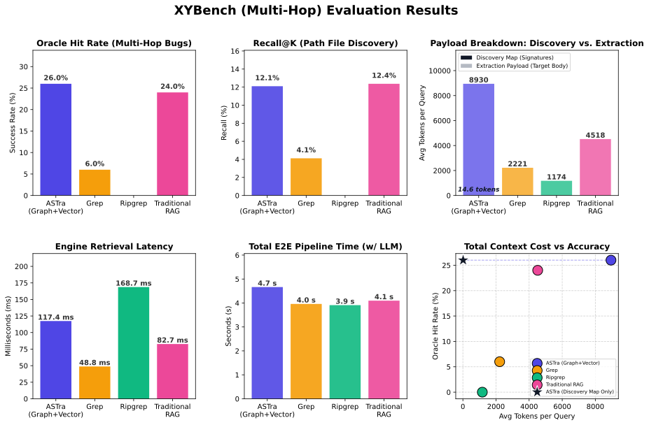

# ASTRA (Abstract Syntax Tree Retrieval Augmentation)

Local semantic code search MCP server for Rust, Python, and JavaScript/TypeScript workspaces.


[](https://modpotato.dev/blog/astra-release/)

## What is ASTRA?

ASTRA is a local-only semantic code search server that runs as an MCP process over stdio. It parses source with tree-sitter, builds an AST call graph, and searches with A* traversal biased by semantic similarity. Search runs locally after indexing, so normal query execution does not call external APIs. ASTRA currently supports Rust, Python, and JavaScript/TypeScript.

<p align="center">
  
</p>

## MCP Tools

| Tool | Purpose |
|---|---|
| `astra_semantic_rag_search` | Semantic RAG over indexed symbols |
| `astra_semantic_path_search` | Execution-path-aware traversal through the call graph |
| `astra_structured_path_search` | Execution-path-aware traversal returned as structured JSON text |

## Installation

ASTRA can be installed directly from source or configured with different feature profiles to suit your machine.

**Fully Local (Default)**
Compiles the generic `BAAI/bge-base-en-v1.5` dense model using `fastembed` and ONNX Runtime:
```bash
cargo install --path .
```
*(Optional)* Add CUDA GPU acceleration:
```bash
cargo install --path . --features cuda
```

**Lightweight Cloud Model (OpenRouter)**
If you want to skip compiling ONNX bindings and avoid downloading the local model, you can use the OpenRouter API instead. This creates a much smaller binary and compiles almost instantly:
```bash
cargo install --path . --no-default-features --features openrouter
```

## Usage as MCP Server

Claude Desktop / Cursor (`claude_desktop_config.json`):

```json
{
  "mcpServers": {
    "astra": {
      "command": "astra",
      "args": ["."]
    }
  }
}
```

For the **OpenRouter** embedding provider, pass environment variables:

```json
{
  "mcpServers": {
    "astra": {
      "command": "astra",
      "args": ["."],
      "env": {
        "ASTRA_EMBEDDING_PROVIDER": "openrouter",
        "OPENROUTER_API_KEY": "sk-or-v1-...",
        "OPENROUTER_MODEL": "openai/text-embedding-3-small"
      }
    }
  }
}
```

On first run, ASTRA performs a cold-start index build for the workspace. Subsequent runs load persisted index data from disk.

## Benchmarks

ASTRA is evaluated on [XYbench](benchmarks/xybench/), a retrieval-focused subset of SWE-bench-lite. It measures how effectively different tools can retrieve the "oracle" files (the files actually modified in the pull request) given only the issue description.

### Retrieval Performance (XYbench, 50 cases)

| Metric | **ASTRA** | Traditional RAG | Grep | Ripgrep |
|---|---:|---:|---:|---:|
| **Oracle file hit-rate** | **26.0 %** | 24.0 % | 6.0 % | 0.0 % |
| **Recall@k** (Top-10) | 12.1 % | **12.3 %** | 4.1 % | 0.0 % |
| **Retrieval Median** | 114.5 ms | 57.2 ms | **24.7 ms** | 170.6 ms |
| **Avg. Content Tokens** | 11,891 | 4,755 | 1,433 | **77** |

*Retrieval latency includes embedding generation, graph traversal, and context assembly. First-run indexing time depends on repository size; subsequent runs load persisted graph and vector data from disk.*

### Transparency & Shortcomings

While ASTRA excels at semantic discovery, it comes with trade-offs:
- **Latency**: ASTRA's graph traversal and embedding generation are significantly slower than simple keyword search (regex/grep).
- **Context Size**: Due to its "semantic expansion" strategy, ASTRA often pulls in much more context than keyword-based tools. While this improves the oracle hit-rate, it puts more pressure on the LLM's context window.
- **Large Repository Overhead**: On small/medium repos, ASTRA is extremely fast, but on large repositories like Django, the overhead of graph search and embedding calculation becomes visible.

Full benchmark reports are under `benchmarks/reports/`.

## How It Works

- Parse source files with tree-sitter.
- Build a cross-symbol call graph with `petgraph`.
- Generate symbol embeddings with `BAAI/bge-base-en-v1.5` via ONNX Runtime (`fastembed`), fully local.
- Run A* traversal over the graph, with expansion biased by semantic similarity.
- Return skeleton context (signature + lightweight context) for traversal nodes.
- Return full source for the terminal node selected for the final answer context.
- Persist graph and vector index artifacts so warm restarts can load from disk.

## License

MIT
